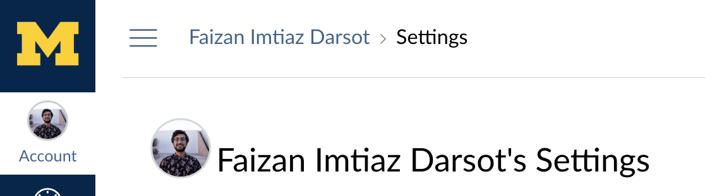
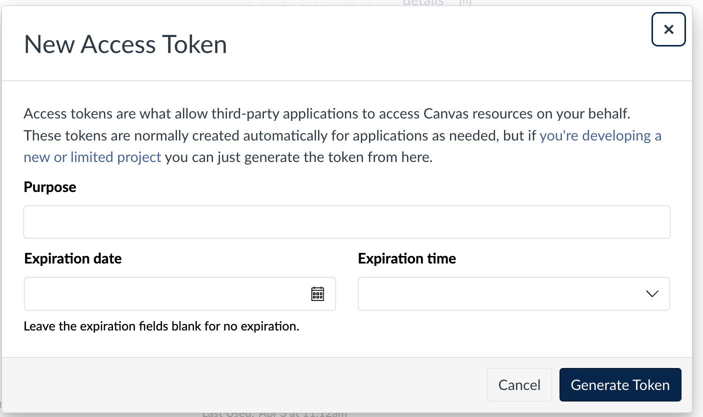

# Canvas File Downloader

*This only works right now if you are just from umich, you can EDIT the canvas link on the top of the python script "canvas_downloader" for your school and it will work*

Description: This script allows you to select which classes on canvas you would like to download all the files from


Setup 
For mac users
```
python3 -m venv venv
source venv/bin/activate
pip install -r requirements.txt
```


Create a API Key by going from:
1. Accounts settings in Canvas

2. Create a new access token under the "Approved Integrations"

3. Write in "My canvas downloader for purpose" And create a arbituary expiration date and time. SAVE the key generation here (since it is shown only ONCE) and enter the information into the python code above WITH the quotes!

The API Key looks something like this:
"1700~L9MPJL2342BXyeKxxMJJG3Fu4chCn24QaasdfamMNTChJNmU44ChzGEeashdf4GMT"
 


After you edit these two fields in the code:
API_URL = "https://umich.instructure.com"  # Replace with your Canvas URL
API_TOKEN = "Enter your key here!"

You should be set to run the code!
``` 
python3 canvas_downloader.py 
```


